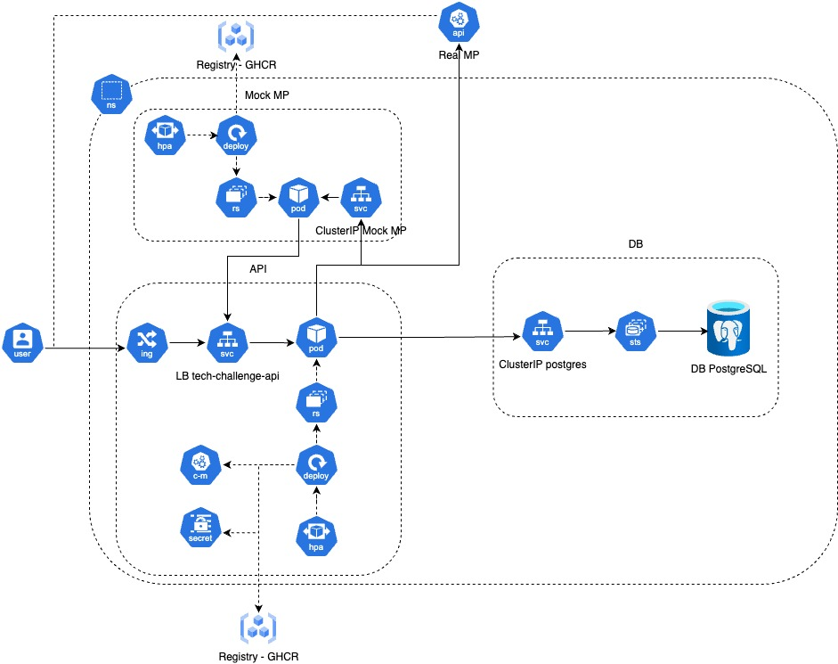

<a name="readme-top"></a>

# <p align="center"><b>Fast Food</b> <small>FIAP Tech Challenge 4 - Infrastructure Deploy (k8s)</small></p>

<p align="center">
    
</p>

<p align="center">
    
</p>

## 💬 About

Repository for the [FIAP](https://postech.fiap.com.br/) Tech Challenge 4, focused on deploying a microservices architecture using Kubernetes.

## 🔗 Related Projects

This project is part of a larger system that includes:

- [Customer Service](https://github.com/FIAP-SOAT-G20/tc4-customer-service)
- [Order Service](https://github.com/FIAP-SOAT-G20/tc4-order-service)
- [Payment Service](https://github.com/FIAP-SOAT-G20/tc4-payment-service)
- [Kitchen Service](https://github.com/FIAP-SOAT-G20/tc4-kitchen-service)
- [Infrastructure -Terraform](https://github.com/FIAP-SOAT-G20/tc4-infrastructure-tf)

## 🏗️ Architecture

### K8s



### :open_file_folder: Project Structure

```sh
.
├── configs
├── ingress
├── namespace
└── services
    ├── customer-service
    ├── kitchen-service
    │   ├── api
    │   └── worker
    ├── order-service
        ├── api
        └── worker
```

<p align="right">(<a href="#readme-top">back to top</a>)</p>


## :computer: Technologies

- [Kubernetes](https://kubernetes.io/)

## :scroll: Requirements

- Kubernetes cluster (minikube, kind, EKS, etc.)
- [kubectl CLI](https://kubernetes.io/docs/tasks/tools/)
- [AWS CLI](https://aws.amazon.com/cli/)

<p align="right">(<a href="#readme-top">back to top</a>)</p>

## :cd: Installation

```sh
git clone https://github.com/FIAP-SOAT-G20/tc4-infrastructure-deploy
```

```sh
cd tc4-infrastructure-deploy
```

<p align="right">(<a href="#readme-top">back to top</a>)</p>

## :runner: Running

```sh
make aws-eks-auth
```

```sh
make k8s-apply
```

<p align="right">(<a href="#readme-top">back to top</a>)</p>

## :clap: Acknowledgments

- [Kubernetes](https://kubernetes.io/)

<p align="right">(<a href="#readme-top">back to top</a>)</p>

## :busts_in_silhouette: Contributors

<div align="center">
  <table>
    <tbody>
      <tr>
        <td align="center" valign="top" width="14.28%"><a href="https://github.com/atomaz"><br /><sub><b>Alice Tomaz</b></sub></a><br />
        <td align="center" valign="top" width="14.28%"><a href="https://github.com/filipe1309"><br /><sub><b>Filipe Bonfim</b></sub></a><br />
        <td align="center" valign="top" width="14.28%"><a href="https://github.com/hugokishi"><br /><sub><b>Hugo Kishi</b></sub></a><br />
        <td align="center" valign="top" width="14.28%"><a href="https://github.com/marcos-nsantos"><br /><sub><b>Marcos Santos</b></sub></a><br />
        <td align="center" valign="top" width="14.28%"><a href="https://github.com/th3r4ven"><br /><sub><b>Matheus</b></sub></a><br />
      </tr>
    </tbody>
  </table>
</div>

<p align="right">(<a href="#readme-top">back to top</a>)</p>
